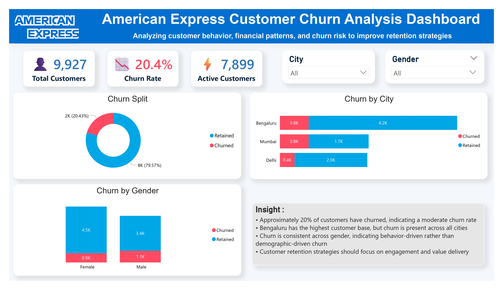
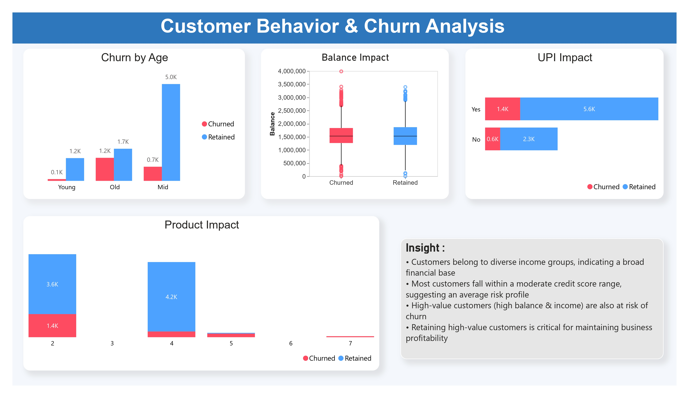
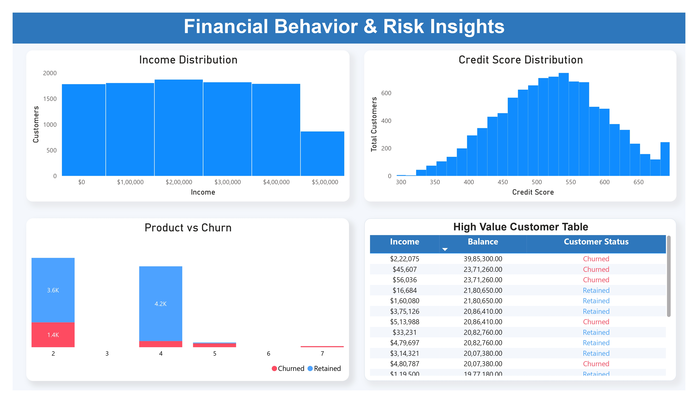

# 📊 American Express Customer Churn Analysis

## 📌 Project Overview

This project focuses on analyzing customer churn behavior using a simulated American Express dataset.
The goal is to identify key factors affecting customer retention and provide actionable business insights.

---

## 🎯 Objectives

* Analyze customer churn patterns
* Identify high-risk customer segments
* Understand the impact of customer behavior and financial attributes
* Provide data-driven recommendations for improving retention

---

## 🛠️ Tools & Technologies

* Python (Pandas, Matplotlib, Seaborn)
* SQL (MySQL)
* Power BI

---

## 📂 Project Structure

```
American-Express-Churn-Analysis/
│
├── dataset/
│   ├── raw_data.csv
│   └── amex_cleaned.csv
│
├── notebooks/
│   └── amex_churn_analysis.ipynb
│
├── sql/
│   └── churn_analysis.sql
│
├── dashboard/
│   └── amex_dashboard.pbix
│
├── dashboard_images/
│   ├── executive_overview.jpg
│   ├── customer_behavior.jpg
│   └── financial_analysis.jpg
│
├── certificate/
│   └── prepinsta_certificate.pdf
│
└── README.md  
```

---

## 📊 Dashboard Preview

### 🔹 Executive Overview



### 🔹 Customer Behavior Analysis



### 🔹 Financial & Risk Analysis



---

## 🔍 Key Insights

* Approximately 20% of customers have churned
* High-balance customers show higher churn risk
* Customers with fewer products are more likely to churn
* Low engagement (UPI inactive) strongly impacts churn
* Older customers show higher churn tendency

---

## 🚀 Business Recommendations

* Focus on retaining high-value customers
* Promote cross-selling strategies
* Improve digital engagement (UPI usage)
* Develop targeted retention strategies for high-risk segments

---

## 🏅 Certification

This project is supported by a certification from PrepInsta for successful completion of the **American Express Data Analysis Project**.

📄 View Certificate:
[certificate/prepinsta_certificate.pdf](certificate/prepinsta_certificate.pdf)

---

## ⚠️ Disclaimer

This project uses a simulated dataset for educational purposes and is not affiliated with American Express.

---

## 👨‍💻 Author

Anuj Magre
